### Задание 1
**Напишите ответ в свободной форме, не больше одного абзаца текста.**

Установите Docker Compose и опишите, для чего он нужен и как может улучшить лично вашу жизнь.

**Ответ**
Docker Compose устанавливается вместе с Docker при помощи команды (для Ubuntu) `sudo apt install docker-ce docker-ce-cli containerd.io docker-buildx-plugin docker-compose-plugin`
Docker Compose упрощает запуск контейнеров, т.е. нет необходимости запускатьк аждый отдельный контейнер через Docker run, 
достаточно конфигурационного файла `docker-compose.yml`, гд будет прописан каждый сервис с его настройкой.
Также если один из сервисов падает / удален / случилось еще что-то невообразимое, достаточно будет заново использовать команду docker compose -d, чтобы автоматически 
найти упавший сервис, пересоздать его или обновть если например версия в `docker-compose.yml` изменилась.

---

### Задание 2 

**Выполните действия и приложите текст конфига на этом этапе.** 

Создайте файл docker-compose.yml и внесите туда первичные настройки: 

 * version;
 * services;
 * volumes;
 * networks.

При выполнении задания используйте подсеть 10.5.0.0/16.
Ваша подсеть должна называться: <ваши фамилия и инициалы>-my-netology-hw.
Все приложения из последующих заданий должны находиться в этой конфигурации.

**Ответ**
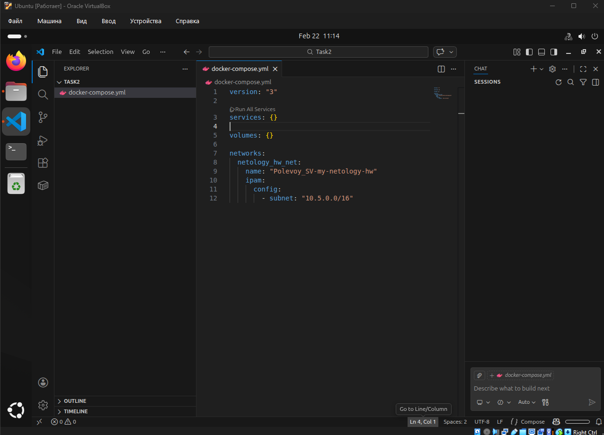

---

### Задание 3 

**Выполните действия:** 

1. Создайте конфигурацию docker-compose для Prometheus с именем контейнера <ваши фамилия и инициалы>-netology-prometheus. 
2. Добавьте необходимые тома с данными и конфигурацией (конфигурация лежит в репозитории в директории [6-04/prometheus](https://github.com/netology-code/sdvps-homeworks/tree/main/lecture_demos/6-04/prometheus) ).
3. Обеспечьте внешний доступ к порту 9090 c докер-сервера.

**Ответ**
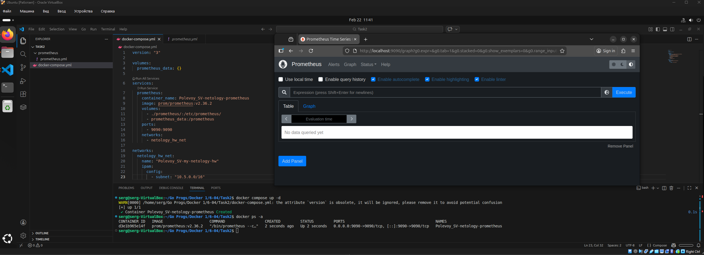

---

### Задание 4 

**Выполните действия:**

1. Создайте конфигурацию docker-compose для Pushgateway с именем контейнера <ваши фамилия и инициалы>-netology-pushgateway. 
2. Обеспечьте внешний доступ к порту 9091 c докер-сервера.

**Ответ**
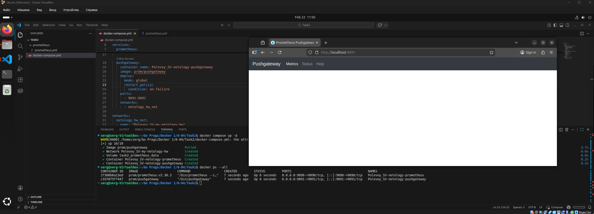

---

### Задание 5 

**Выполните действия:** 

1. Создайте конфигурацию docker-compose для Grafana с именем контейнера <ваши фамилия и инициалы>-netology-grafana. 
2. Добавьте необходимые тома с данными и конфигурацией (конфигурация лежит в репозитории в директории [6-04/grafana](https://github.com/netology-code/sdvps-homeworks/blob/main/lecture_demos/6-04/grafana/custom.ini).
3. Добавьте переменную окружения с путем до файла с кастомными настройками (должен быть в томе), в самом файле пропишите логин=<ваши фамилия и инициалы> пароль=netology.
4. Обеспечьте внешний доступ к порту 3000 c порта 80 докер-сервера.

**Ответ**
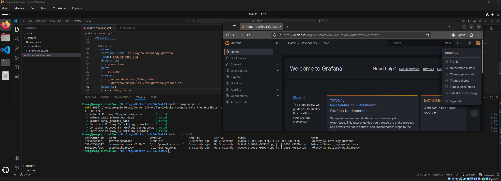

---

### Задание 6 

**Выполните действия.**

1. Настройте поочередность запуска контейнеров.
2. Настройте режимы перезапуска для контейнеров.
3. Настройте использование контейнерами одной сети.
4. Запустите сценарий в detached режиме.

**Ответ**
```
volumes:
  prometheus_data: {}
  grafana_data: {}

services:
  prometheus:
    container_name: Polevoy_SV-netology-prometheus
    image: prom/prometheus:v2.36.2
    restart: unless-stopped
    volumes:
      - ./prometheus:/etc/prometheus/
      - prometheus_data:/prometheus
    ports:
      - "9090:9090"
    networks:
      - netology_hw_net

  pushgateway:
    container_name: Polevoy_SV-netology-pushgateway
    image: prom/pushgateway
    restart: on-failure
    depends_on:
      - prometheus
    ports:
      - "9091:9091"
    networks:
      - netology_hw_net

  grafana:
    container_name: Polevoy_SV-netology-grafana
    image: grafana/grafana
    restart: unless-stopped
    depends_on:
      - prometheus
      - pushgateway
    ports:
      - "80:3000"
    volumes:
      - grafana_data:/var/lib/grafana
      - ./grafana/custom.ini:/etc/grafana/grafana.ini
    networks:
      - netology_hw_net

networks:
  netology_hw_net:
    name: "Polevoy_SV-my-netology-hw"
    ipam:
      config:
        - subnet: "10.5.0.0/16"
```

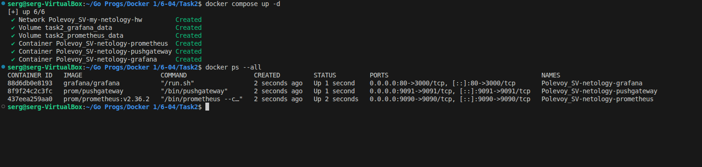

---

### Задание 7 

**Выполните действия.**
1. Выполните запрос в Pushgateway для помещения метрики <ваши фамилия и инициалы> со значением 5 в Prometheus: ```echo "<ваши фамилия и инициалы> 5" | curl --data-binary @- http://localhost:9091/metrics/job/netology```.
2. Залогиньтесь в Grafana с помощью логина и пароля из предыдущего задания.
3. Cоздайте Data Source Prometheus (Home -> Connections -> Data sources -> Add data source -> Prometheus -> указать "Prometheus server URL = http://prometheus:9090" -> Save & Test).
4. Создайте график на основе добавленной в пункте 5 метрики (Build a dashboard -> Add visualization -> Prometheus -> Select metric -> Metric explorer -> <ваши фамилия и инициалы -> Apply.

В качестве решения приложите:

* docker-compose.yml **целиком**;
* скриншот команды docker ps после запуске docker-compose.yml;
* скриншот графика, постоенного на основе вашей метрики.

**Ответ**
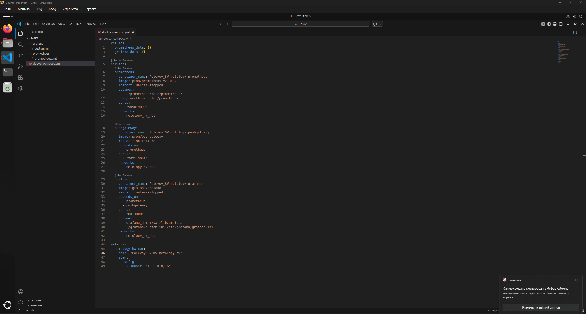
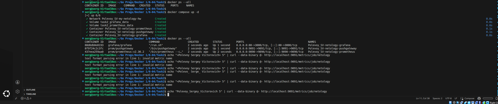
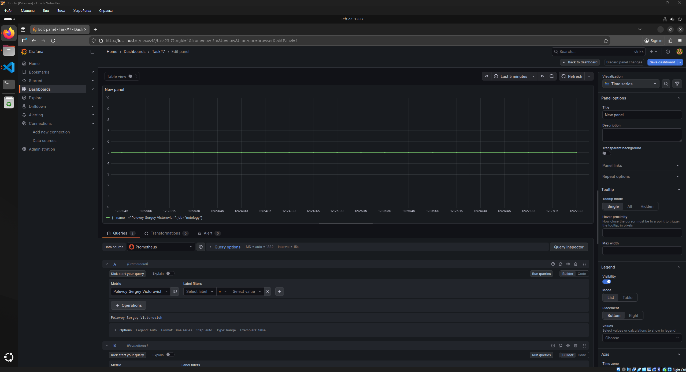
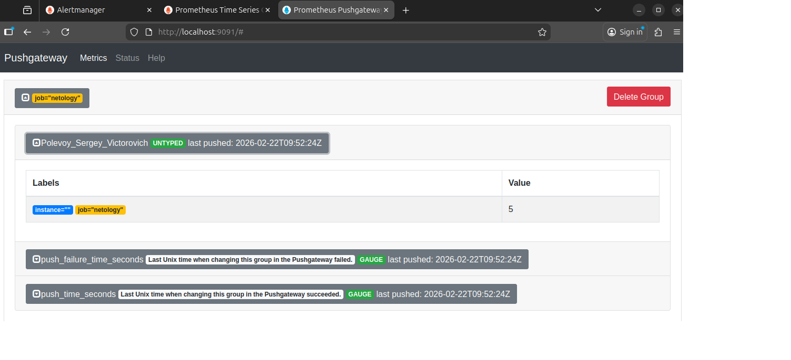

---

### Задание 8

**Выполните действия:** 

1. Остановите и удалите все контейнеры одной командой.

В качестве решения приложите скриншот консоли с проделанными действиями.

**Ответ**
Тут два варианта, либо правильный docker compose down -v, либо docker rm -v -f $(docker ps -qa)
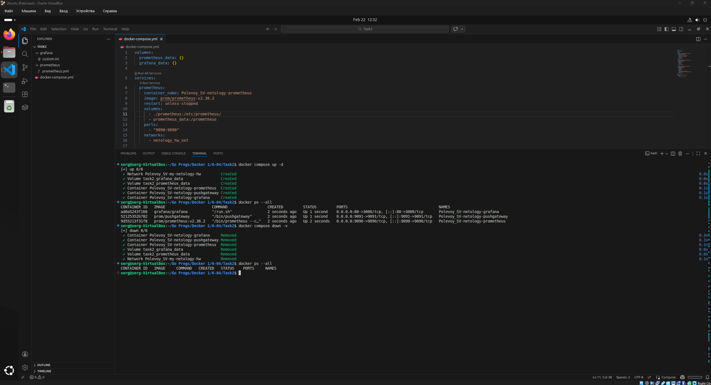
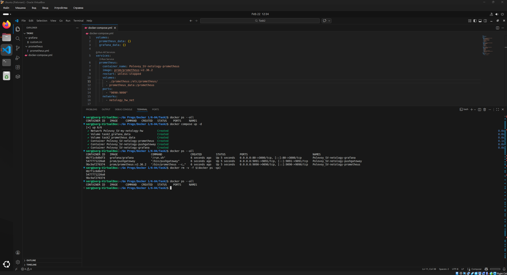

---


## Дополнительные задания* (со звёздочкой)

Их выполнение необязательное и не влияет на получение зачёта по домашнему заданию. Можете их решить, если хотите лучше разобраться в материале.

---

### Задание 9* 

**Выполните действия:** 

1. Создайте конфигурацию docker-compose для Alertmanager с именем контейнера <ваши фамилия и инициалы>-netology-alertmanager. 
2. Добавьте необходимые тома с данными и [конфигурацией](https://github.com/netology-code/sdvps-homeworks/tree/main/6-04/alertmanager), сеть, режим и очередность запуска.
3. Обновите конфигурацию Prometheus (необходимые изменения ищите в презентации или документации) и перезапустите его. 
4. Обеспечьте внешний доступ к порту 9093 c докер-сервера.

В качестве решения приложите скриншот с событием из Alertmanager.

**Ответ**
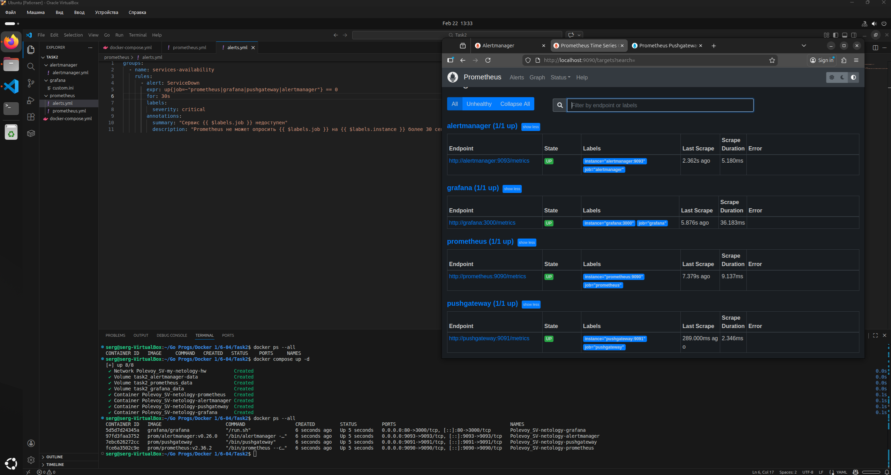
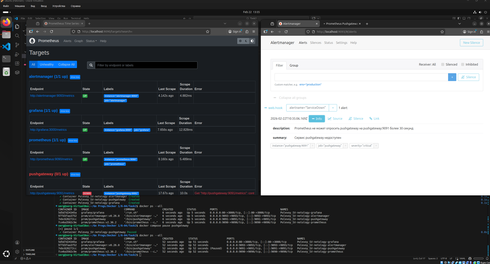
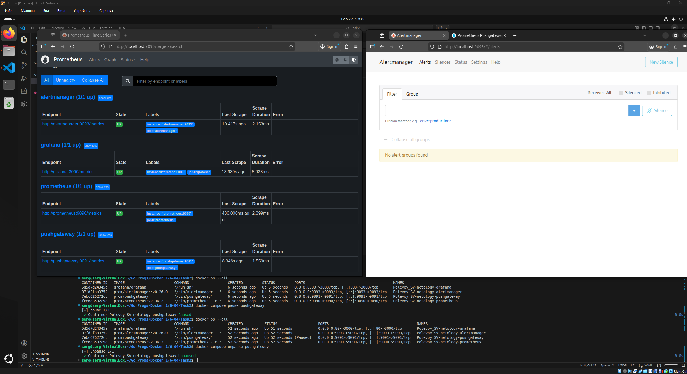

---

### Задание 10* 

Запустите свой сценарий на чистом железе без предзагруженных образов.

**Ответьте на вопросы в свободной форме:**

1. Опишите выполненный вами процесс развертывания сценария.
2. Как вы думаете зачем может понадобиться такой способ развертывания?

**Ответ**


1. Просто перенес docker-compose.yml и другие .ini, .yml файлы сервисов и развернул на другой системе по одной команде docker compose up -d
2. Легкий перенос сервисов на разные ПК, разную архитекутуру, вместо ста установщиков и прочих зависимостей, удобно