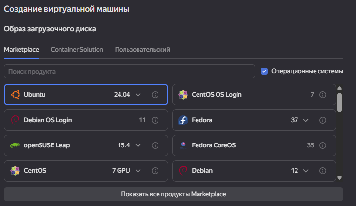
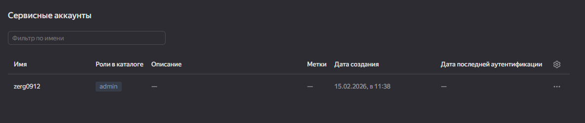
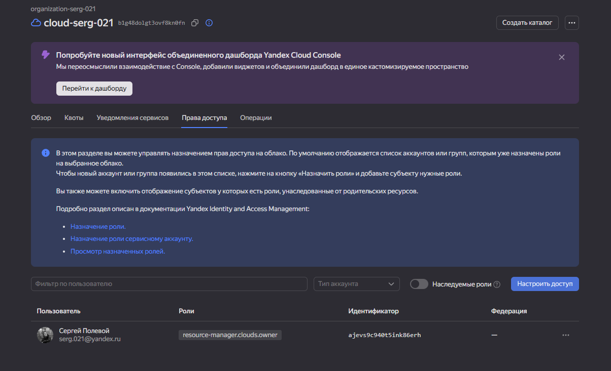
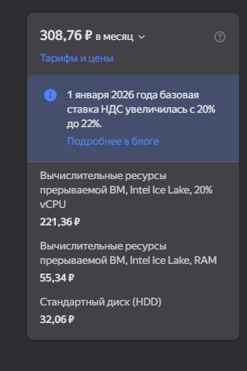
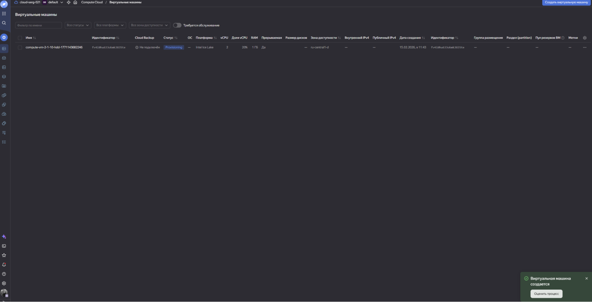
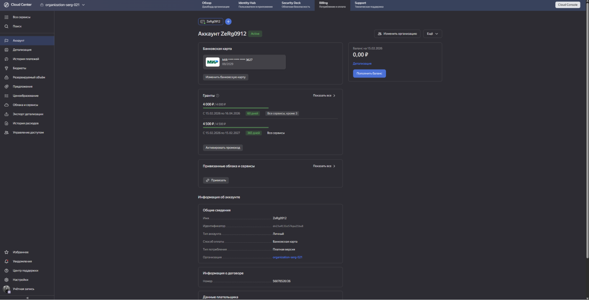
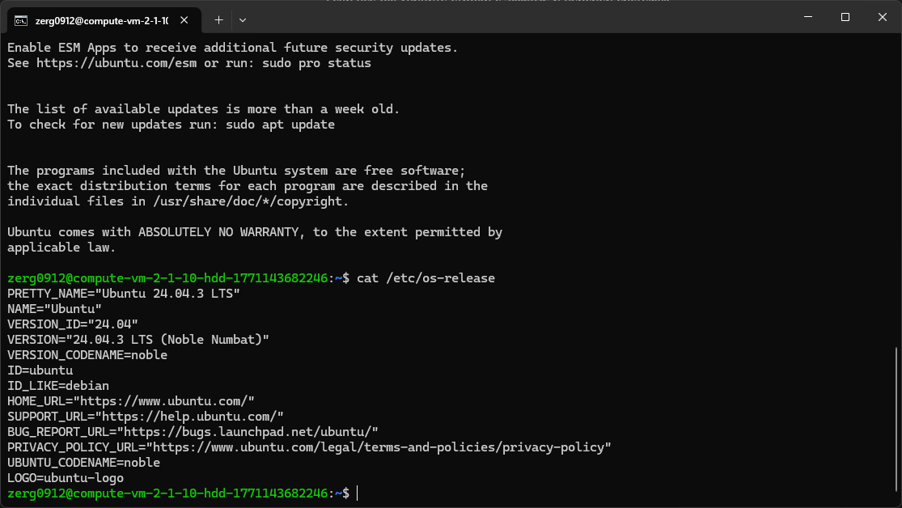
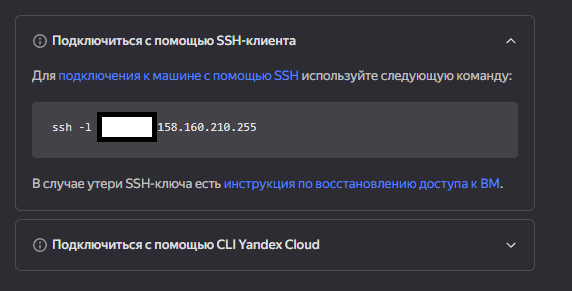
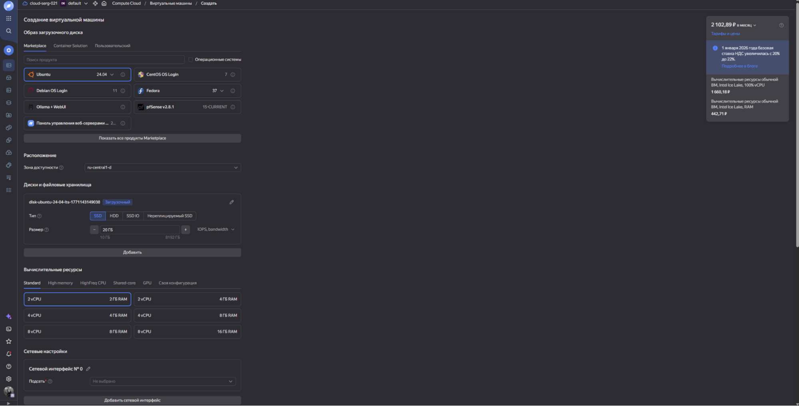
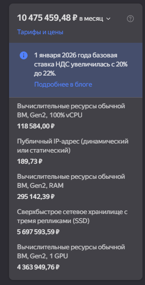

# Задание 1
Ответьте на вопрос в свободной форме.  
Чем частное облако отличается от общедоступного, публичного и гибридного?  

**Ответ:**  
В том, кто владеет инфраструктурой, кто ей пользуется и как управляется безопасность/стоимость.

**Частное облако (private)** — инфраструктура выделена **только одной компании**.  
Главные отличия: максимум контроля, изоляции и кастомизации, но обычно дороже и сложнее в сопровождении.

**Общедоступное \= публичное облако (public)** — это по сути одно и то же: ресурсы провайдера для многих клиентов.  
Отличия от частного: меньше контроля, зато быстрее запуск, проще масштабирование и оплата по потреблению.

**Гибридное облако (hybrid)** — комбинация частного и публичного.  
Отличие: можно держать чувствительные данные в частном облаке, а переменные нагрузки выносить в публичное; гибче, но сложнее в управлении.

# Задание 2
Что обозначают: IaaS, PaaS, SaaS, CaaS, DRaaS, BaaS, DBaaS, MaaS, DaaS, NaaS, STaaS? Напишите примеры их использования.  

**Ответ:**  
**IaaS (Infrastructure as a Service)** \- аренда инфраструктуры: VM/сети/хранилище; ОС и приложение обычно администрируете вы.  
Пример: поднять тестовый стенд из VM для CI/CD и выключать его после прогонов.

**PaaS (Platform as a Service)** \- готовая платформа для запуска кода без управления базовой инфраструктурой.  
Пример: задеплоить REST API в Azure App Service и масштабировать по нагрузке.

**SaaS (Software as a Service)** \- готовое приложение через интернет/браузер.  
Пример: корпоративная почта и документы как подписка (Google Workspace/аналог).

**CaaS (Containers as a Service)** \- сервис для запуска и управления контейнерами/оркестрацией.  
Пример: микросервисная система в Kubernetes через managed-сервис (например, EKS).

**DRaaS (Disaster Recovery as a Service)** \- аварийное восстановление из облака (репликация, failover, восстановление).  
Пример: при падении основного ЦОДа переключить критичные VM на облачную DR-площадку.

**BaaS:**  
**BaaS (Backup as a Service)**\- резервное копирование как услуга.  
Пример: ежедневные off-site бэкапы БД и быстрый restore.  
**Banking as a Service** — банки дают API, через которые небанковские компании встраивают финансовые сервисы.  
**Backend as a Service**: готовый backend (auth, storage, API) для веб/мобайл.  
Пример**:** не писать свой backend для приложения, а использовать BaaS-платформу.

**DBaaS (Database as a Service)** \- управляемая БД без установки/обслуживания серверов БД.  
Пример: использовать managed PostgreSQL для продакшн-сервиса с автоматическими бэкапами и обновлениями.

**MaaS:**  
**Monitoring as a Service**: внешний мониторинг инфраструктуры/приложений.  
Пример**:** метрики, алерты и доступность сервисов по подписке.  
**Metal as a Service**: облакоподобное управление bare-metal серверами.  
Пример**:** автопровижининг физических нод для приватного кластера.

**DaaS (Desktop as a Service)** \- виртуальные рабочие столы из облака.  
Пример: выдать подрядчикам безопасные удалённые рабочие места без выдачи корпоративных ноутбуков.

**NaaS (Network as a Service)** \- сетевые функции как облачный сервис, без владения своей сетевой инфраструктурой.  
Пример: подключить филиалы через облачную сеть/VPN/фаервол как услугу.

**STaaS (Storage as a Service)** \- хранилище как подписка с масштабированием по требованию.  
Пример: хранить архивы, логи и медиа в облачном хранилище вместо покупки собственных СХД.

# Задание 3
Ответьте на вопрос в свободной форме.  
Напишите, какой вид сервиса предоставляется пользователю в ситуациях:

1. Всеми процессами управляет провайдер.  
2. Вы управляете приложением и данными, остальным управляет провайдер.  
3. Вы управляете операционной системой, средой исполнения, данными, приложениями, остальными управляет провайдер.  
4. Вы управляете сетью, хранилищами, серверами, виртуализацией, операционной системой, средой исполнения, данными, приложениями.  
   

**Ответ:**

1. «Всеми процессами управляет провайдер» \= **SaaS (*Software as a Service*)**.   
   Пользователь просто использует готовое ПО.  
2. «Вы управляете приложением и данными, остальным управляет провайдер» \= **PaaS (*Platform as a Service*)**.   
   Вы отвечаете за код/логику и данные, платформа и инфраструктура — на провайдере.  
3. «Вы управляете операционной системой, средой исполнения, данными, приложениями, остальными управляет провайдер» \= **IaaS (*Infrastructure as a Service*)**.   
   Провайдер дает инфраструктурный слой, а ОС и всё выше это ваша зона ответственности.  
4. «Вы управляете сетью, хранилищами, серверами, виртуализацией, ОС, средой исполнения, данными, приложениями» \= **On-Premises (локальная инфраструктура, не облачный сервис)**.  
   модель развертывания программного обеспечения и инфраструктуры, когда все ресурсы, включая оборудование и данные, находятся внутри компании, на её собственных серверах, а не в облаке.

# Задание 4
Вы работаете ИТ-специалистом в своей компании. Перед вами встал вопрос: покупать физический сервер или арендовать облачный сервис от [Yandex Cloud](https://cloud.yandex.ru/).  
Выполните действия и приложите скриншоты по каждому этапу:

1. Создать платёжный аккаунт:  
* зайти в консоль;  
* выбрать меню биллинг;  
* зарегистрировать аккаунт.

     2\. После регистрации выбрать меню в консоли Computer cloud.  
     3\. Приступить к созданию виртуальной машины.  
Ответьте на вопросы в свободной форме:

1. Какие ОС можно выбрать?  
2. Какие параметры сервера можно выбрать?  
3. Какие компоненты мониторинга можно создать?  
4. Какие системы безопасности предусмотрены?  
5. Как меняется цена от выбранных характеристик? Приведите пример самой дорогой и самой дешёвой конфигурации.

**Ответ:**  
1\. Создать платежный аккунт:  
  
2 и 3\. После регистрации выбрать меню в консоли Computer cloud. Приступить к созданию виртуальной машины.  

Ответы на вопросы в свободной форме:  
1\. Доступные ОС из Marketplace (Windows нет, в основном Linux версии), можно загрузить свою из контейнера или по образу в разделе Пользовательский.  
  
2\. Какие параметры сервера можно выбрать:  
Процессор (кол-во ядер и частоту), кол-во RAM, если есть необходимость то кол-во GPU, например для своей AI обучаемой модели. Самый простой вариант и дешевый это Shared-core.  
3\. Какие компоненты мониторинга можно создать:  
Сервисный дашборды и алерты в сервисе yandex monitoring  
4\. Какие системы безопасности предусмотрены?  
*Группа безопасности* (Security Group, SG) — это ресурс, который создается на уровне [облачной сети](https://yandex.cloud/ru/docs/vpc/concepts/network#network). После создания группа безопасности может использоваться в сервисах Yandex Cloud для разграничения сетевого доступа объекта, к которому она применяется.  
*Группа безопасности по умолчанию* (Default Security Group, DSG) создается автоматически при создании [новой облачной сети](https://yandex.cloud/ru/docs/vpc/concepts/network#network). Группа безопасности по умолчанию обладает следующими свойствами:

* В новой сети будет разрешать весь сетевой трафик в обоих направлениях — исходящий (egress) и входящий (ingress).  
* Действует для трафика, проходящего через все подсети в сети, где она создана.  
* Работает лишь в том случае, если на объект еще явно не назначена группа безопасности.  
* Ее невозможно удалить, она автоматически удаляется вместе с удалением сети.

Группы безопасности можно комбинировать — на один объект можно назначить до пяти групп.

  
5\. Как меняется цена от выбранных характеристик? Приведите пример самой дорогой и самой дешёвой конфигурации.  
   
Все зависит от выбранных параметров сервера и сети.

# Задание 5\*
Выполните действия и приложите скриншот:

1. Создайте виртуальную машину на Yandex Cloud.  
2. Создайте сервисный аккаунт.  
3. Отсканируйте SSH-ключ.  
4. Придумайте логин.  
5. Подключитесь к облаку через SSH.

Ответ:  
1\.  
  
2\.   
3\.   
  
4, 5\.  
