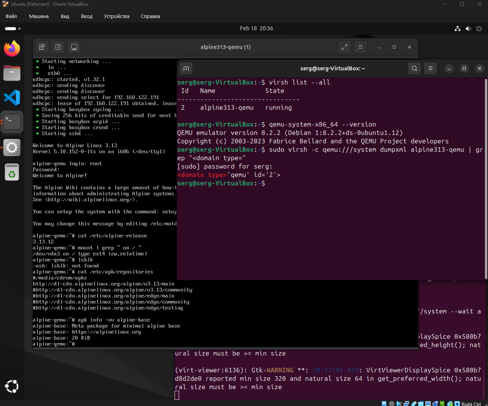
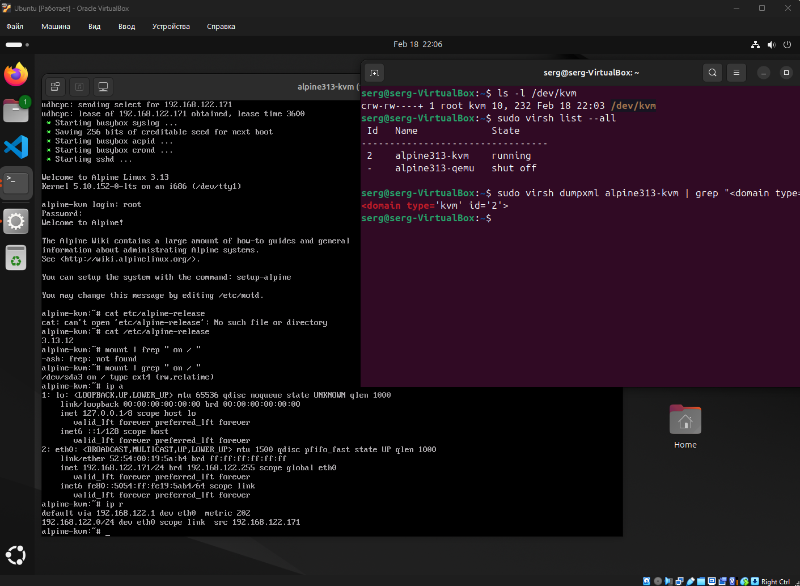

### Задание 1

Выполните действия и приложите скриншоты по каждому этапу:

1. Установите QEMU в зависимости от системы.  
2. Создайте виртуальную машину.  
3. Установите виртуальную машину. Можете использовать пример [по ссылке](https://dl-cdn.alpinelinux.org/alpine/v3.13/releases/x86/alpine-standard-3.13.5-x86.iso). Пример взят [с сайта](https://alpinelinux.org/).

Если KVM уже установлен, создайте ВМ без использования аппаратной виртуализации.  
В случае использования virt-install используйте параметр \--virt-type=qemu.  
**Использовал локальный iso из задания:**  
sudo virt-install \\  
  \--virt-type=qemu \\  
  \--name alpine313-qemu \\  
  \--memory 1024 \--vcpus 1 \\  
  \--disk path=/var/lib/libvirt/images/alpine313.qcow2,size=9,format=qcow2,bus=virtio,io=threads,cache=none \\  
  \--cdrom /var/lib/libvirt/boot/alpine-standard-3.13.5-x86.iso \\  
  \--graphics vnc  

---

### Задание 2

Выполните действия и приложите скриншоты по каждому этапу:

1. Установите KVM и библиотеку libvirt.  
2. Создайте виртуальную машину.  
3. Установите виртуальную машину. Можете использовать пример [по ссылке](https://dl-cdn.alpinelinux.org/alpine/v3.13/releases/x86/alpine-standard-3.13.5-x86.iso). Пример взят [с сайта](https://alpinelinux.org/).

В случае использования virt-install используйте параметр \--virt-type=kvm.  
**Использовал локальный iso из задания:**  
sudo virt-install \\  
  \--virt-type=kvm \\  
  \--name alpine313-kvm \\  
  \--memory 1024 \--vcpus 1 \\  
  \--arch i686 \\  
  \--cpu qemu32 \\  
  \--machine pc \\  
  \--disk path=/var/lib/libvirt/images/alpine313-kvm.qcow2,size=7,format=qcow2,bus=ide,cache=none \\  
  \--cdrom /var/lib/libvirt/boot/alpine-standard-3.13.5-x86.iso \\  
  \--network network=default,model=e1000 \\  
  \--graphics vnc \\  
  \--video cirrus \\  
  \--boot cdrom,hd,menu=on  

---

### Задание 3

Напишите, как изменилось время установки и старта системы при аппаратной виртуализации (KVM) по сравнению с программной эмуляцией (QEMU).

По моим измерениям/наблюдениям время установки и первого старта Alpine при аппаратной виртуализации (KVM) и при программной эмуляции (QEMU) оказалось примерно одинаковым.  
**Теоретически** KVM быстрее QEMU, потому что использует аппаратные инструкции виртуализации и снижает накладные расходы на выполнение кода гостя.  
**Практически** в моём случае разница по времени установки и старта оказалась **минимальной**, вероятно из\-за упора в диск/сеть и особенностей конфигурации/совместимости.

---

### Задание 4\*

1. Установите виртуальные (alpine) машины двух различных архитектур, отличных от X86 в QEMU.  
2. Приложите скриншоты действий.